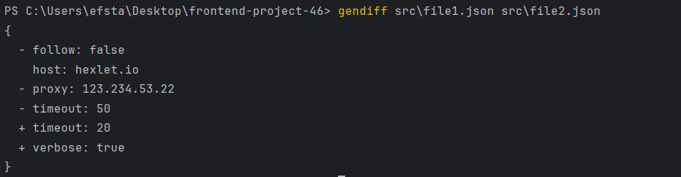

### Hexlet tests and linter status:
[](https://github.com/Makkini/frontend-project-46/actions)

## Установка
1. Склонируйте репозиторий:
   ```bash
   git clone https://github.com/Makkini/frontend-project-46.git
2. Установка зависимостей:
    ```bash
   npm install

## Скриншоты тестов


